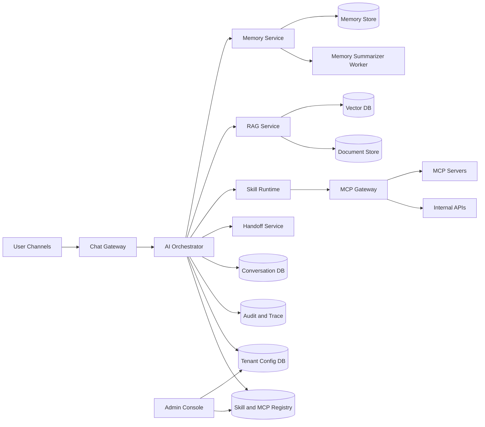
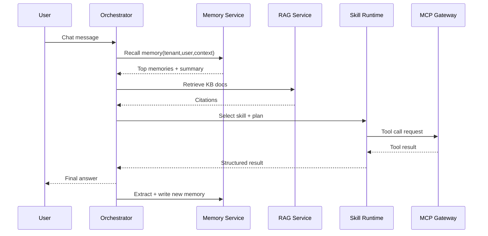

# PRD — AI Support Bot đa tenant cho công ty phần mềm (v1.1, memory-first)

- **Owner:** Master Orchestrator
- **Ngày cập nhật:** 2026-03-05
- **Trạng thái:** Ready for implementation
- **Mục tiêu:** Chuyển từ kiến trúc RAG-centric sang Memory-first, chuẩn hóa setup skills + MCP cho từng tenant, đảm bảo scale và governance.

---

## 0) Delta từ v1.0 -> v1.1

### Bổ sung lớn
1. **Memory Layer là hạ tầng độc lập** (không còn là phần phụ của RAG)
2. **Tenant Runtime Provisioning**: setup tự động cho mỗi tenant (memory, skills, MCP, policy)
3. **Skill Registry + MCP Gateway** theo tenant scope
4. **Conflict resolution + memory decay + audit cho memory**
5. **Mermaid diagrams sửa theo format tương thích GitHub**

### Vì sao cần đổi
- LLM stateless, context window lớn không giải quyết được nhất quán dài hạn.
- Multi-tenant production cần governance: policy, isolation, traceability.
- Giảm token cost, giảm drift, tăng personalization và consistency.

---

## 1) Tóm tắt sản phẩm

Xây **AI Support Bot đa tenant** có khả năng:
1. Trả lời câu hỏi bằng **Memory + RAG** theo tenant
2. Tự gọi **tool/API nội bộ qua MCP Gateway**
3. Tự phân loại hội thoại + handoff khi cần
4. Cho phép tenant tự cấu hình model, flow, skill, guardrail
5. Đảm bảo isolation, compliance, audit end-to-end

---

## 2) Mục tiêu & KPI (90 ngày)

- **Deflection rate:** >= 40%
- **First response p95:** < 10 giây
- **Intent accuracy:** >= 90%
- **Tool-call success:** >= 98%
- **Handoff đúng nhóm:** >= 90%
- **CSAT:** >= 4.2/5

### KPI mới cho memory-first
- **Consistency rate (cross-session):** >= 85%
- **Memory precision@k:** >= 80%
- **Personalization success:** >= 75%
- **Memory drift rate:** < 5%

---

## 3) Roles & Permissions (RBAC)

Roles:
1. End User
2. Support Agent
3. Support Lead
4. Tenant Admin
5. System Admin
6. AI Bot

Nguyên tắc:
- Mọi request bắt buộc `tenant_id`
- Tool/MCP call chỉ đi qua policy engine
- AI Bot không có quyền vượt role/policy
- Tất cả memory read/write có audit log

---

## 4) Chức năng chi tiết (Functions)

### F-001 — Intent Detection & Routing
- Intent: `how_to_use`, `billing_receivable`, `sales_lookup`, `bug_report`, `other`
- Output: intent, confidence, recommended_flow

### F-002 — RAG theo tenant
- Ingest tài liệu (PDF, DOCX, Markdown, URL)
- Chunk + embedding + namespace theo tenant
- Retrieval + rerank + citation

### F-003 — Tool Calling nội bộ (qua MCP)
- Tool mẫu:
  - `check_receivable_by_month`
  - `check_receivable_by_sales`
  - `get_customer_contract_status`
- Validate schema + timeout/retry/circuit breaker

### F-004 — Handoff người thật
- Trigger: low confidence, user request, tool fail liên tiếp, bug nghiêm trọng

### F-005 — Label & Conversation Management
- Labels: `how_to_use`, `billing`, `sales`, `bug`, `feature_request`, `urgent`
- Status: `open`, `waiting_user`, `resolved`, `escalated`

### F-006 — Tenant Configuration
- Model/provider, prompt policy, tool allowlist, handoff rules, locale/tone, threshold

### F-007 — Dynamic Flow Builder
- JSON state machine, versioning, rollback

### F-008 — Observability & Analytics
- Trace mỗi turn, dashboard KPI

### F-009 — Memory Layer (mới, bắt buộc)
- Memory extraction sau mỗi turn
- Memory types:
  - `profile` (sở thích, style)
  - `episodic` (sự kiện hội thoại)
  - `semantic` (fact ổn định)
  - `procedural` (quy tắc workflow)
- Memory recall trước khi generate
- Summarization theo category
- Conflict resolution + decay

### F-010 — Tenant Skill Setup (mới)
- Skill pack mặc định theo domain tenant
- Tenant bật/tắt skill theo allowlist
- Version pinning + staged rollout

### F-011 — MCP Connector Setup (mới)
- Bind tenant với MCP server đã duyệt
- Secret theo tenant scope
- Health check + fallback policy

---

## 5) Kiến trúc hệ thống (mới)

### 5.1 Logical Architecture (GitHub Mermaid compatible)

### 5.2 Request Execution Flow (Memory-first)

### 5.3 Service boundaries
- **Gateway:** channel adapters
- **Orchestrator:** flow/state/policy orchestration
- **Memory Service:** extraction, recall, summaries, conflict/decay
- **RAG Service:** ingestion/retrieval/rerank/citation
- **Skill Runtime:** execute skills theo tenant config
- **MCP Gateway:** chuẩn hóa tool call ra external/internal systems
- **Handoff Service:** queue + SLA

### 5.4 Multi-tenant isolation model
- DB row-level theo `tenant_id`
- Memory partition theo `tenant_id` + `user_id`
- Vector namespace theo `tenant_id`
- Secret manager theo tenant scope
- MCP credentials tách riêng từng tenant

---

## 6) Tenant Runtime Provisioning (mới)

Khi onboard tenant, chạy provisioning gồm 4 bước:

1. **Memory bootstrap**
   - Tạo memory categories mặc định
   - Seed memory policy (write/recall/retention)

2. **Skill bootstrap**
   - Gắn skill pack mặc định theo ngành
   - Enable skill theo role matrix

3. **MCP bootstrap**
   - Bind tới MCP servers approved
   - Verify auth + health + capabilities

4. **Policy bootstrap**
   - RBAC + tool policy + PII policy + audit policy

Provisioning phải idempotent và có rollback.

---

## 7) Tech Stack đề xuất

- **Backend:** NestJS (Node.js)
- **DB:** PostgreSQL 16
- **Vector:** pgvector (v1), nâng Qdrant khi scale
- **Queue/Worker:** Redis + BullMQ
- **Admin UI:** Next.js + TypeScript
- **Auth/RBAC:** Keycloak/Auth0 (OIDC)
- **Observability:** OpenTelemetry + Prometheus + Grafana + Loki
- **Object Storage:** MinIO/GCS

---

## 8) Data Model (v1.1)

### 8.1 Bảng lõi giữ nguyên
- `tenants`
- `tenant_configs`
- `users`
- `conversations`
- `messages`
- `kb_documents`
- `kb_chunks`
- `tool_definitions`
- `tool_call_logs`
- `handoff_events`
- `audit_logs`

### 8.2 Bảng mới cho memory-first
- `memory_resources(id, tenant_id, conversation_id, message_id, raw_ref, created_at)`
- `memory_items(id, tenant_id, user_id, type, category, fact_text, confidence, importance, pii_level, source_id, status, valid_from, valid_to, created_at, updated_at)`
- `memory_summaries(id, tenant_id, user_id, category, summary_text, version, generated_at)`
- `memory_conflicts(id, tenant_id, user_id, old_item_id, new_item_id, resolution, resolved_by, resolved_at)`
- `memory_access_logs(id, tenant_id, conversation_id, memory_item_id, action, actor_type, created_at)`

### 8.3 Bảng mới cho skills + MCP
- `skills_registry(id, name, version, manifest, status, created_at)`
- `tenant_skill_bindings(tenant_id, skill_id, version, enabled, config_json, updated_at)`
- `mcp_servers(id, name, endpoint, transport, capabilities, status, created_at)`
- `tenant_mcp_bindings(tenant_id, mcp_server_id, enabled, secret_ref, policy_json, updated_at)`
- `mcp_tool_policies(tenant_id, role, tool_name, allowed, rate_limit, pii_scope, updated_at)`

---

## 9) API Contracts (v1.1)

### 9.1 Chat APIs
- `POST /v1/tenants/{tenantId}/chat/message`
- `GET /v1/tenants/{tenantId}/conversations/{id}`
- `POST /v1/tenants/{tenantId}/conversations/{id}/labels`

### 9.2 Tenant provisioning
- `POST /v1/tenants/{tenantId}/bootstrap`
- `POST /v1/tenants/{tenantId}/bootstrap/validate`

### 9.3 Memory APIs
- `GET /v1/tenants/{tenantId}/users/{userId}/memory`
- `POST /v1/tenants/{tenantId}/users/{userId}/memory/upsert`
- `POST /v1/tenants/{tenantId}/users/{userId}/memory/forget`
- `POST /v1/tenants/{tenantId}/memory/rebuild-summary`

### 9.4 Skills APIs
- `PUT /v1/tenants/{tenantId}/skills`
- `POST /v1/tenants/{tenantId}/skills/validate`

### 9.5 MCP APIs
- `PUT /v1/tenants/{tenantId}/mcp-bindings`
- `POST /v1/tenants/{tenantId}/mcp-test-connection`
- `POST /v1/tenants/{tenantId}/mcp-health-check`

---

## 10) Ranking, Conflict Resolution, Memory Decay

### 10.1 Recall ranking
`score = w1*relevance + w2*recency + w3*importance + w4*confidence - w5*risk`

Hard filters:
- Bắt buộc match `tenant_id`
- Scope theo role/user
- Chặn memory có `pii_level` vượt policy

### 10.2 Conflict resolution
- Fact mới mâu thuẫn fact cũ -> tạo bản ghi conflict
- Chưa auto-delete fact cũ
- Chọn active fact theo confidence + recency + admin override

### 10.3 Memory decay
- `episodic`: TTL 7-30 ngày
- `profile/semantic`: TTL dài hơn, decay chậm
- `pinned memories`: không decay nếu chưa unpin

---

## 11) Security & Compliance (nâng cấp)

- JWT + tenant claim bắt buộc
- Secret Manager cho tool/MCP creds
- PII tagging ở memory item level
- PII masking trong logs
- Right-to-delete memory per user
- Rate-limit theo user + tenant
- Prompt injection guard bắt buộc trước tool call
- Audit trail cho memory read/write + MCP calls

---

## 12) Rollout plan (chi tiết)

### Phase 1 (2 tuần) — Memory-first Core
- Orchestrator tích hợp Memory Recall trước RAG
- Memory write pipeline cơ bản
- 1 tool qua MCP Gateway
- Basic handoff

### Phase 2 (2 tuần) — Tenant Setup Automation
- Tenant bootstrap APIs
- Skill bindings + allowlist
- MCP binding + health checks
- Admin màn hình setup tenant runtime

### Phase 3 (2 tuần) — Governance & Quality
- Conflict resolution + memory decay
- KPI dashboard cho memory metrics
- Security hardening + isolation tests

### Phase 4 (1-2 tuần) — Pilot & Hardening
- Pilot 1-3 tenant thực tế
- Load/chaos/security test
- Runbook vận hành + rollback drills

---

## 13) Testing strategy (v1.1)

- **Unit:** ranking, memory extractor, conflict resolver, policy checks
- **Integration:** memory + RAG merge, skill runtime + MCP gateway
- **E2E:** 5 use-cases cũ + 3 use-cases memory (consistency/personalization/forget)
- **Security:** tenant isolation, privilege escalation, PII leakage
- **Chaos:** MCP timeout, vector DB degraded, memory store lag

---

## 14) Acceptance Criteria (Go-Live)

- [ ] 5 use-cases chính pass UAT
- [ ] Memory consistency >= 85%
- [ ] Tool/MCP calls có audit đầy đủ
- [ ] Handoff đúng queue >= 90%
- [ ] Deflection >= 30% trong pilot
- [ ] Không rò rỉ dữ liệu cross-tenant
- [ ] Runbook + rollback đã diễn tập

---

## 15) Risks & Mitigations

1. **Memory recall sai ngữ cảnh**
   - Mitigation: ranking + confidence gate + human feedback loop
2. **MCP connector không ổn định**
   - Mitigation: health check + circuit breaker + fallback handoff
3. **Tenant setup quá phức tạp**
   - Mitigation: provisioning templates + staged rollout
4. **PII risk trong memory**
   - Mitigation: pii tagging + masking + delete workflows

---

## 16) Bước tiếp theo ngay

1. Chốt schema mới: `memory_items`, `tenant_skill_bindings`, `tenant_mcp_bindings`
2. Chốt API bootstrap + memory + mcp health-check
3. Build vertical slice mới: chat -> memory recall -> tool via MCP -> response -> memory write -> audit
4. Demo nội bộ với 1 tenant trong 3-5 ngày, đo consistency + latency
